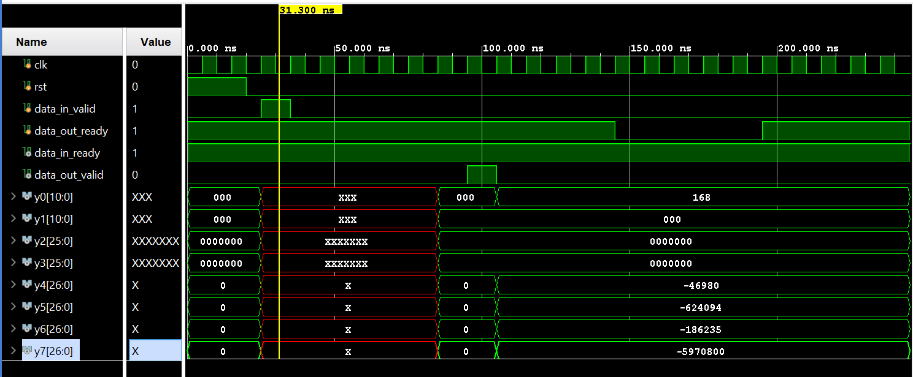

# Pipelined 8-Point 1D DCT Hardware Accelerator

## Overview

This repository contains a Verilog implementation of a pipelined hardware accelerator for the 8-point 1D Discrete Cosine Transform (DCT-II). The design is optimized for ASIC implementation and targets high throughput using a 4-stage pipeline, Canonical Signed Digit (CSD) multipliers, and a simple handshake interface. A testbench is included for functional verification and simulation.

## Key features

- 4-stage pipelined 1D 8-point DCT core
- Streaming valid/ready handshake (AXI-like) for input/output flow control
- CSD-based constant multipliers for hardware-efficient implementation
- Testbench for behavioral verification and simulation

## DCT-II

The DCT-II is widely used in image and video compression (e.g., JPEG, MPEG, HEVC). By transforming spatial-domain pixel values into frequency-domain coefficients, the DCT concentrates most of the signal energy in a small number of low-frequency coefficients — enabling efficient compression. A pipelined hardware accelerator provides low-latency, high-throughput DCT computation suitable for ASIC and FPGA integration.

Design summary

- Transform: 1D DCT-II, N = 8
- Pipeline stages: 4 (staged arithmetic with pipeline registers)
- Interface: Streaming valid/ready handshake (data_in_valid, data_in_ready, data_out_valid, data_out_ready)
- Control: CSR registers for configuration and status monitoring
- Target: ASIC (suitable for FPGA prototyping)

Mathematical definition (1D DCT-II)

For a 1D signal x[n] of length N:

X[k] = sum_{n=0}^{N-1} x[n] * cos(pi/N * (n + 1/2) * k),  for k = 0..N-1

(The 2D DCT is obtained by applying the 1D DCT along rows and then columns.)

Repository layout

- /rtl  - Verilog RTL sources for the DCT core, controller, and support modules
- /tb   - Testbench and stimulus files used for simulation
- /docs - (optional) design notes and diagrams
- README.md - This document

## Interfaces and handshake

This core is built around a streaming handshake to decouple producer/consumer timing from internal computation:

- data_in_valid (input): Indicates new input data is available from the producer
- data_in_ready (output): Asserts when the DCT core can accept the next input
- data_out_valid (output): Asserts when output data is valid and stable
- data_out_ready (input): Driven by the downstream consumer to accept output

The controller implements pipeline stall behavior: when data_out_valid is high and data_out_ready is low, the pipeline and output registers are frozen (no progress) to maintain data coherency.

## Pipelined architecture

The core is split into 4 pipeline stages. Each stage performs part of the DCT arithmetic and stores intermediate results in pipeline registers. This organization enables a sustained throughput of one input per clock cycle after pipeline fill (latency = number of stages). The project uses CSD multipliers to reduce area and power while maintaining precision for constant multiplications.

## Test Run
The input given is [10,20,30,40,50,60,70,80]
The expected output is [ 358.92740213 -181.67350924    0.          -18.99142539    0.
   -5.66546189    0.    -1.4298055 ].

The obtained output from the waveform must be scaled properly which gives [360 -182.2 0 -19.05 0 -5.683 0 -1.42] as they are in Q1.15 format. So we have an error of about 0.21 percentage

## Testing and verification

- A behavioral testbench is included in /tb. Use it to run vectors and verify the functional correctness of the core.
- Recommended verification steps:
  1. Run the testbench and check that the output matches a golden-model DCT (software reference).
  2. The accuracy of the obtained data is computed alongside python function.

- 2025-10-27: README rewritten and reorganized for clarity and usability.
